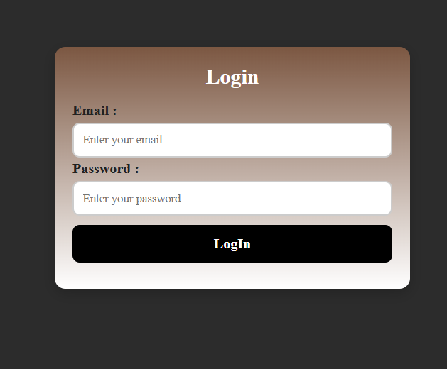

# Login Form Validation 🔐

This is my **first project** uploaded on GitHub 🎉.  
A simple and responsive **Login Form** built with **HTML, CSS, and JavaScript** that validates user input in real-time.

---

## 🚀 Features
- Email validation using Regex  
- Strong password validation (uppercase, lowercase, number, special character, min length 8)  
- Error messages shown below inputs  
- Success message with auto-hide feature  
- Responsive and modern UI with hover effects  

---

## 🛠️ Tech Stack
- **HTML5**  
- **CSS3** (custom styling + responsive design)  
- **JavaScript (ES6)** (form validation)

---

## 📸 Screenshots
  

